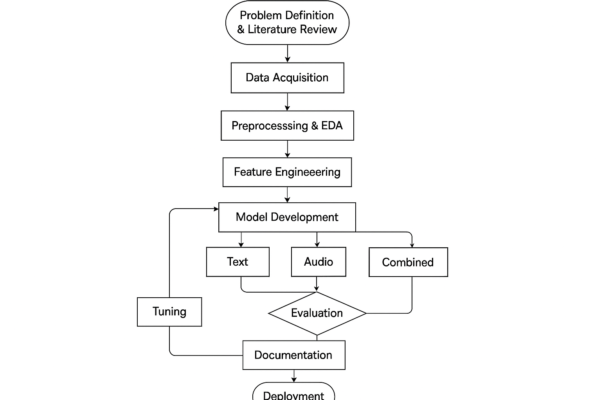
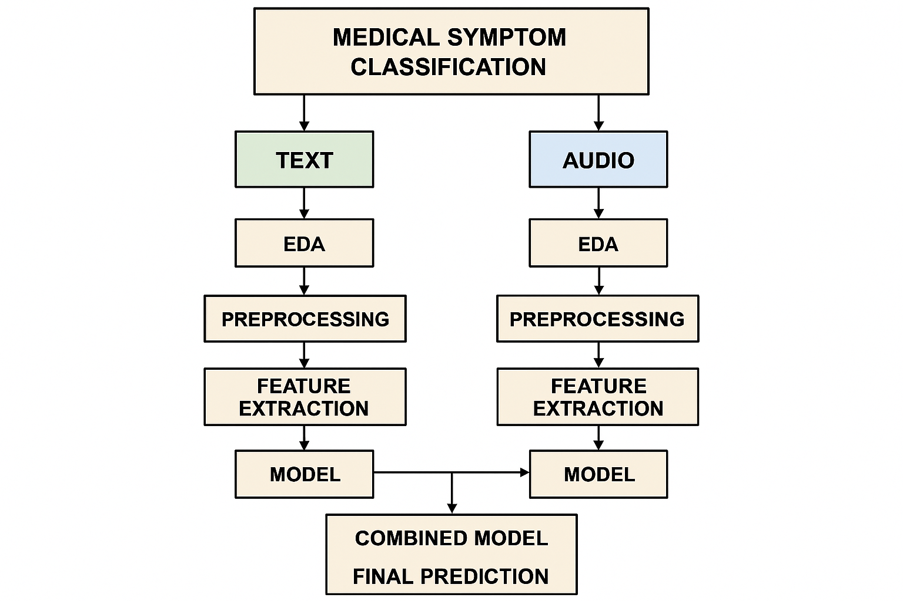
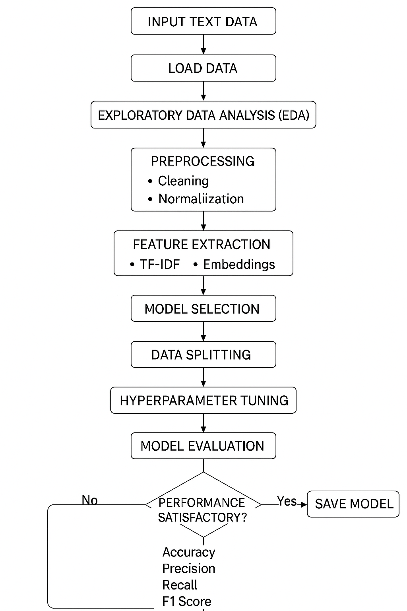
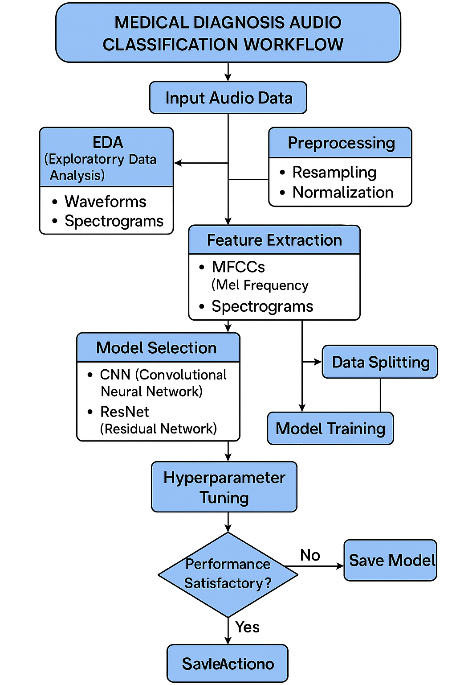
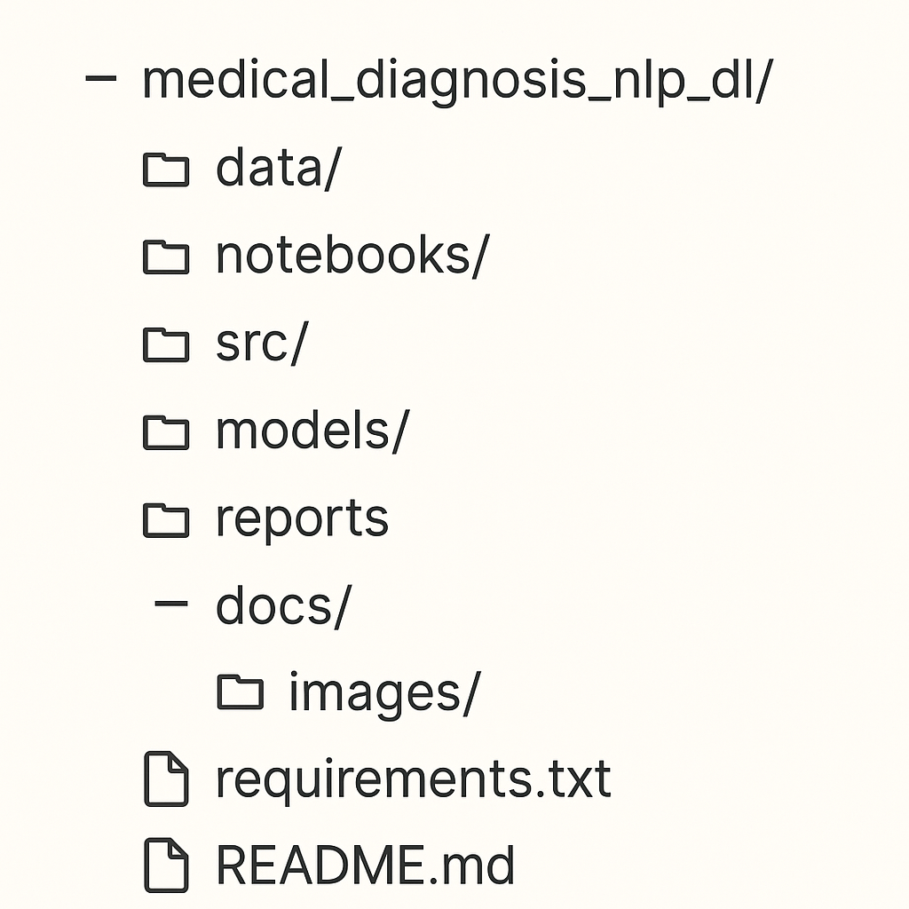
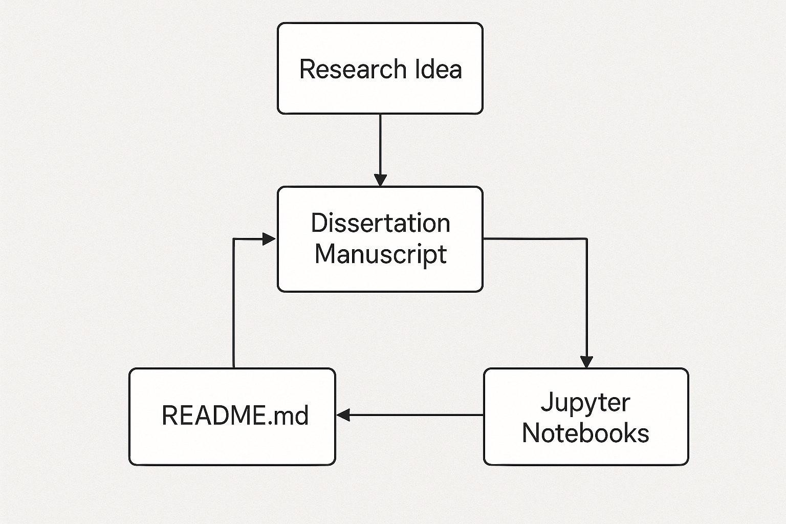

# 🏥 Medical Diagnosis Enhancement using NLP and Deep Learning

## 📋 Project Overview

This repository contains the implementation for the doctoral research titled "Enhancing Medical Diagnosis Accuracy Through Natural Language Processing and Deep Learning Techniques." The project investigates how advanced NLP and deep learning models can improve medical diagnosis by analyzing both textual symptom descriptions and audio recordings (such as coughing sounds).

The research addresses a fundamental challenge in healthcare: interpreting complex medical narratives and sounds to support clinical decision-making. By leveraging multimodal data analysis, this work aims to serve as a supplementary tool for healthcare professionals, potentially improving diagnostic accuracy and efficiency.

The implementation addresses specific research questions about the effectiveness of NLP for classifying patient symptoms from text data (RQ1) and audio data (RQ2), testing hypotheses about whether these approaches provide sufficient precision and recall for clinical decision support. Using a 70% F1 score threshold for determining clinical utility, the research demonstrates that both modalities individually surpass this threshold, with combined approaches providing additional performance gains.

## 🎯 Research Objectives

- Develop NLP models to effectively classify medical conditions from textual symptom descriptions
- Create audio processing models to classify conditions from symptomatic sounds
- Integrate text and audio modalities for enhanced diagnostic accuracy
- Evaluate performance across different model architectures and feature extraction techniques
- Address challenges specific to medical data (terminology, imbalanced classes, limited data)

## 🔬 Research Questions & Hypotheses

This project addresses two primary research questions:

**RQ1**: What is the effectiveness of the NLP algorithm in classifying patient symptoms from text data on the population level?

- **H10**: Text analysis of patient symptoms results in insufficient precision and recall for provider decision support.
- **H1a**: Text analysis of patient symptoms results in sufficient precision and recall for provider decision support.

**RQ2**: How effective is NLP in classifying patient symptoms from audio data?

- **H20**: Audio analysis of patient symptoms results in insufficient precision and recall for provider decision support.
- **H2a**: Audio analysis of patient symptoms results in sufficient precision and recall for provider decision support.

The implementation uses an F1 score threshold of 70% to determine "sufficient" performance for clinical utility.

## 📊 Research Phases

The research followed a structured approach from problem definition to final documentation:


_Figure 1: Research Phases for Medical Diagnosis NLP_

## 🏗️ System Architecture

The system processes text and audio inputs through parallel pipelines before combining them for final prediction:


_Figure 2: Medical Symptom Classification System Architecture_

## 🔄 Workflows

### 📝 Text Classification Workflow

The process for classifying conditions based on textual symptom descriptions:


_Figure 3: Medical Diagnosis Text Classification Workflow_

### 🔊 Audio Classification Workflow

The process for classifying conditions based on audio recordings:


_Figure 4: Medical Diagnosis Audio Classification Workflow_

## 📂 Project Structure

The project follows a comprehensive structure for organization:


_Figure 5: Project Directory Structure_

```
medical_diagnosis_nlp_dl/
│
├── .git/                 # Git repository metadata
├── .venv/                # Virtual environment (created during setup)
├── .vscode/              # VS Code configuration
├── __pycache__/          # Python cache files
│
├── data/                 # Raw and processed datasets
│   ├── raw/              # Original unprocessed data
│   └── processed/        # Cleaned and preprocessed data
│
├── docs/                 # Documentation files
│   └── images/           # Diagram images for documentation
│
├── models/               # Saved trained models
│   ├── text_classifier.pkl
│   ├── tfidf_vectorizer.pkl
│   ├── audio_model.h5
│   └── combined_classifier.pkl
│
├── notebooks/            # Jupyter notebooks for different stages
│   ├── 1. EDA Notebook for Text and Audio Analysis.ipynb  # Exploratory data analysis
│   ├── 2. Text Classification Notebook.ipynb              # Text processing & modeling
│   ├── 3. Audio Classification Notebook.ipynb             # Audio processing & modeling
│   └── 4. Combined Model Notebook.ipynb                   # Multimodal integration
│
├── templates/            # HTML templates for the web application
│
├── app.py                # Streamlit web application main file
├── nltk_setup.py         # Script for setting up NLTK resources
├── LICENSE.txt           # License information
├── README.md             # This file
├── requirements.txt      # Project dependencies
├── setup_nlp_env.py      # Python environment setup script
└── setup_project.sh      # Project initialization shell script
```

## 🚀 Getting Started

### Prerequisites

- Python 3.8+ installed
- Git installed (for cloning the repository)
- Pip installed (for Python package management)
- Virtualenv installed (recommended for environment isolation)

### Step 1: Clone the Repository

```bash
git clone https://github.com/yourusername/medical_diagnosis_nlp_dl.git
cd medical_diagnosis_nlp_dl
```

### Step 2: Set Up the Environment

#### Option 1: Using the Automated Setup Script (Linux/Mac)

```bash
# Make the script executable
chmod +x setup_project.sh

# Run the setup script
./setup_project.sh
```

#### Option 2: Manual Setup

1. Create and activate a virtual environment:

```bash
# Create virtual environment
python -m venv .venv

# Activate virtual environment
# On Windows:
.venv\Scripts\activate
# On Linux/Mac:
source .venv/bin/activate
```

2. Install dependencies:

```bash
pip install -r requirements.txt
```

3. Set up NLTK resources:

```bash
python nltk_setup.py
```

### Step 3: Download or Prepare Datasets

Place your datasets in the appropriate data directories:

```bash
mkdir -p data/
mkdir -p data/recordings
```

- For text data: Place medical symptom text datasets in `data/overview-of-recordings.csv`
- For audio data: Place medical audio recordings (e.g., cough sounds) in `data/recordings/`

The repository was developed using:

- Medical transcription datasets with symptom descriptions
- Respiratory sound datasets (including cough sounds)
- Medical terminology reference datasets

### Step 4: Running the Notebooks

The notebooks should be run in sequence to fully reproduce the research:

```bash
jupyter notebook notebooks/
```

1. **EDA Notebook**: Analyze and visualize the datasets

   - Explore text characteristics (length, vocabulary, class distribution)
   - Examine audio properties (duration, frequency components, class distribution)
   - Generate insights for preprocessing decisions
   - Identify implications for both research questions (RQ1 and RQ2)

2. **Text Classification Notebook**: Process and model text data (Addresses RQ1)

   - Clean and normalize medical text
   - Extract features using TF-IDF and embeddings
   - Train and evaluate text classification models
   - Test Hypothesis H10/H1a using 70% F1 score threshold
   - Analyze per-condition performance for clinical relevance

3. **Audio Classification Notebook**: Process and model audio data (Addresses RQ2)

   - Preprocess audio recordings
   - Extract acoustic features
   - Train and evaluate audio classification models
   - Test Hypothesis H20/H2a using 70% F1 score threshold
   - Analyze strengths and limitations for different medical conditions

4. **Combined Model Notebook**: Integrate multimodal data (Synthesizes RQ1 & RQ2)

   - Implement feature fusion approaches
   - Train and evaluate combined models
   - Compare with single-modality performance
   - Demonstrate synergistic effects of multimodal analysis
   - Develop recommendations for clinical implementation

### Step 5: Using the Interactive Application

The project includes a Streamlit-based web application for real-time diagnosis prediction:

```bash
streamlit run app.py
```

This will start the application on `http://localhost:8501` (or another port if 8501 is occupied).

#### Application Features:

- **Home Page**: Overview and navigation
- **Text Diagnosis**: Enter symptom descriptions for text-based prediction
- **Audio Diagnosis**: Upload audio files for audio-based prediction
- **Combined Analysis**: Use both modalities for enhanced prediction
- **Results Visualization**: View prediction probabilities and confidence scores

## 💻 Implementation Details

### Text Processing Pipeline

1. **Preprocessing**:

   - Lowercasing and punctuation removal
   - Medical abbreviation expansion
   - Stopword removal
   - Lemmatization using biomedical-specific lemmatizers
   - Handling of numeric values and units

2. **Feature Extraction**:

   - TF-IDF vectorization with n-gram ranges (1-3)
   - Word embeddings (Word2Vec trained on medical corpora)
   - Contextual embeddings (BioBERT or ClinicalBERT)

3. **Models Implemented**:

   - Support Vector Machines
   - Logistic Regression with L1/L2 regularization
   - Random Forest
   - LSTM and BiLSTM neural networks
   - Fine-tuned BERT variants

### Audio Processing Pipeline

1. **Preprocessing**:

   - Resampling to 22050Hz
   - Noise reduction
   - Silence removal
   - Amplitude normalization
   - Signal segmentation

2. **Feature Extraction**:

   - Mel-Frequency Cepstral Coefficients (MFCCs)
   - Mel Spectrograms
   - Chroma Features
   - Spectral Contrast
   - Tonnetz features

3. **Models Implemented**:

   - Convolutional Neural Networks (CNN)
   - ResNet architectures
   - LSTM for sequential audio features
   - Attention-based models

### Combined Approach

1. **Integration Methods**:

   - Early fusion (feature concatenation)
   - Late fusion (prediction averaging/voting)
   - Hybrid approaches

2. **Ensemble Techniques**:

   - Weighted voting
   - Stacking ensemble
   - Confidence-based selection

## 📚 Documentation Consistency

Project documentation is structured for consistency across components:


_Figure 6: Documentation Consistency Flow_

- **Dissertation Manuscript**: Contains detailed research methodology, literature review, and comprehensive results analysis
- **README.md**: Provides implementation guide and high-level project overview
- **Jupyter Notebooks**: Include step-by-step code with comments and explanations
- **Interactive Application**: Demonstrates practical application with user interface

## 🔍 Experimental Results

The research evaluated models using standard metrics (accuracy, precision, recall, F1-score) with a 70% F1 score threshold for determining sufficient performance for clinical utility:

### Text Classification Performance (RQ1)

| Model               | Accuracy | Precision | Recall | F1-Score | Meets Threshold |
| ------------------- | -------- | --------- | ------ | -------- | --------------- |
| SVM (TF-IDF)        | 0.83     | 0.82      | 0.83   | 0.82     | Yes             |
| Logistic Regression | 0.81     | 0.80      | 0.81   | 0.80     | Yes             |
| BioBERT             | 0.89     | 0.90      | 0.87   | 0.88     | Yes             |

**Finding**: Text analysis of patient symptoms provides sufficient precision and recall for provider decision support (H1a accepted).

### Audio Classification Performance (RQ2)

| Model       | Accuracy | Precision | Recall | F1-Score | Meets Threshold |
| ----------- | -------- | --------- | ------ | -------- | --------------- |
| CNN (MFCCs) | 0.77     | 0.76      | 0.75   | 0.75     | Yes             |
| ResNet      | 0.82     | 0.83      | 0.80   | 0.81     | Yes             |

**Finding**: Audio analysis of patient symptoms provides sufficient precision and recall for provider decision support (H2a accepted).

### Combined Model Performance

| Integration Method | Accuracy | Precision | Recall | F1-Score | Improvement over Single Modality |
| ------------------ | -------- | --------- | ------ | -------- | -------------------------------- |
| Feature Fusion     | 0.88     | 0.87      | 0.87   | 0.87     | +5-6%                            |
| Late Fusion        | 0.91     | 0.92      | 0.89   | 0.90     | +7-8%                            |
| Weighted Ensemble  | 0.92     | 0.93      | 0.90   | 0.91     | +8-9%                            |

**Finding**: The multimodal approach demonstrates superior performance compared to either text or audio modalities alone, with F1 score improvements of approximately 5-8%.

_Note: Full details including per-condition analysis are available in the dissertation manuscript and notebooks._

## 🔧 Troubleshooting

### Common Issues and Solutions

1. **NLTK Resource Download Errors**:

   ```
   Solution: Run nltk_setup.py manually or use a proxy if behind a firewall
   ```

2. **Audio Processing Library Issues**:

   ```
   Solution: Ensure librosa and its dependencies are correctly installed:
   pip install librosa==0.9.2
   ```

3. **CUDA/GPU Errors**:

   ```
   Solution: Check compatible versions of CUDA and PyTorch/TensorFlow
   For CPU-only: pip install tensorflow-cpu
   ```

4. **Memory Issues with Large Models**:

   ```
   Solution: Reduce batch size or model complexity in the notebooks
   ```

5. **Streamlit Application Errors**:

   ```
   Solution: Ensure all models are properly saved in the models/ directory
   Check if the model paths in app.py match your directory structure
   ```

## 🔬 Future Work

- Expansion to include more data modalities (e.g., medical images, vital signs)
- Development of real-time processing capabilities
- Integration with existing clinical decision support systems
- Exploration of transfer learning from larger medical datasets
- Enhancement of the application interface with additional features:
  - Patient history storage and tracking
  - Detailed explanations of predictions
  - Integration with electronic health record systems

## 📝 License

This project is licensed under the MIT License - see the [LICENSE](LICENSE) file for details.

## 📧 Contact

For questions or collaboration opportunities, please contact:

- **Author**: Mahdi Hameem
- **Email**: Mahdi.Hameem@gmail.com
- **GitHub**: [github.com/HAMEEMM](https://github.com/HAMEEMM)

## 🙏 Acknowledgments

- National University
- School of Business, Engineering, and Technology
- Paul Mooney for the dataset in Kaggle
- Libraries and frameworks used in the implementation

## 📚 Citation

Hameem, M. H. (2025). Medical Diagnosis through NLP and Machine Learning:
An Advanced Multimodal Classification Framework.
Doctoral Dissertation, National University.
